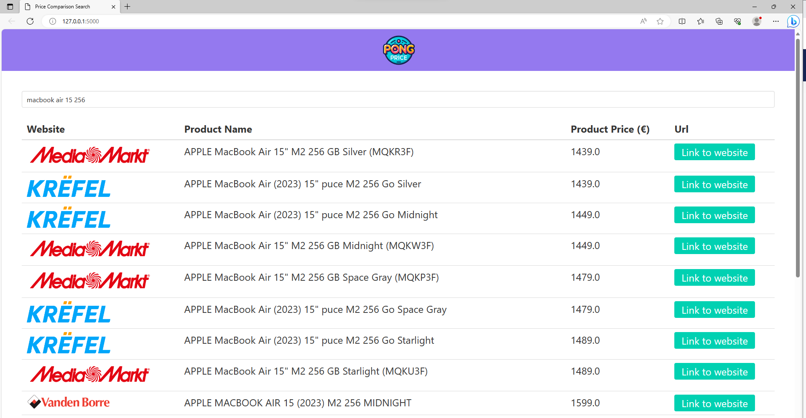

# Pongprice

## Contributors

[ChristosRaptis](https://github.com/ChristosRaptis)

[RamiRambo](https://github.com/RamiRambo)

## Description

This repository includes the code for scraping the sitemaps of the product catalogues of online belgian retailers of our choice. After scraping the products (url, product_name and product_price) we verify and/or include the data to our table in PostgreSQL. We present our tool with Flask and SQLAlchemy for our web interface.

This is a project made for training purposes and to display the skills of the contributors. Our goal was to practice skills/tools such as webscrapping with Selenium & Playwright & requests, PostgreSQL, Flask/SQLAlchemy + HTML, htmx.

Our work is structured as follows : 

*app.py* file is the script for the web interface of our tool (Flask but Streamlit was also used).
*scrapers* folder : includes in scraper.py our class Scraper, and main.py the code to run it for three websites of our choice.
*templates* folder : includes the html code that works with Flask and our script app.py in the main folder.
*static* folder : includes the images for our webtool.

## Installation

Install the following packages to be able to run : 

- requests
- beautifulSoup
- concurrent.futures
- flask
- flask_sqlalchemy
- HTMX
- psycopg2
- re (Regex)

Used in drafts only for learning purposes :
Playwright
Selenium

## Run

Run the file **app.py** which is the website interface of our tool that links the html and postgresql queries : 
            $ *Flask run*

Run **main.py** to scrape websites and to include them in the PostgreSQL table.

Prerequisites : make up your PostgreSQL environment & table and include the credentials to connect to it in a **.env** file.

## Visuals

    

